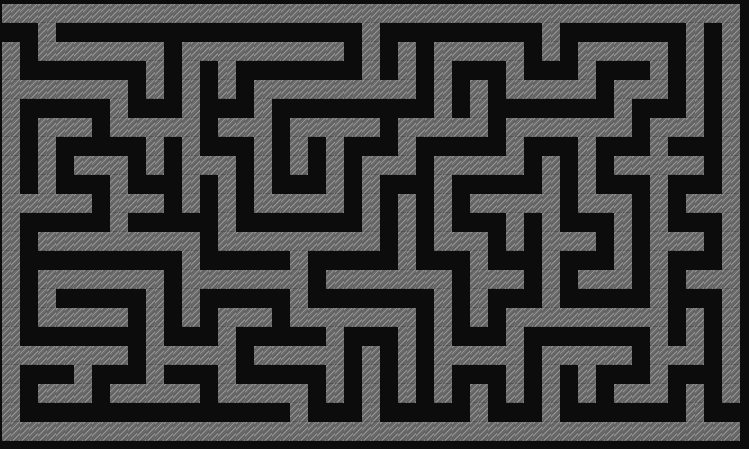

# Maze Generator

This is just a learning Rust project inspired by the first 12 chapters of amazing Rust book https://doc.rust-lang.org/book/
and my great love to mazes.

User will get the menu to interact with the program via CLI:

Example of a generated maze:

Solved maze:
